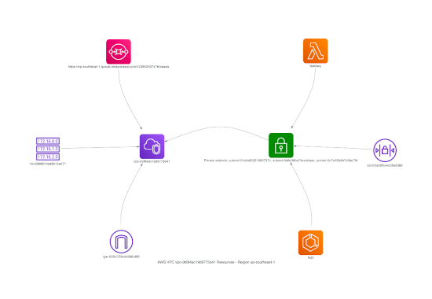
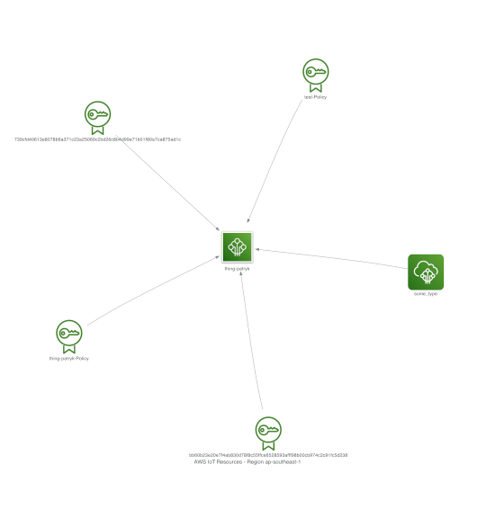

# Cloud Discovery


[](https://circleci.com/gh/Cloud-Architects/cloud-discovery)
[](https://www.codacy.com/gh/Cloud-Architects/cloud-discovery?utm_source=github.com&amp;utm_medium=referral&amp;utm_content=Cloud-Architects/cloud-discoveryy&amp;utm_campaign=Badge_Grade)
[](https://github.com/Cloud-Architects/cloud-discovery/blob/develop/LICENSE)

Cloud Discovery helps you to analyze resources in your cloud (AWS/GCP/Azure/Alibaba/IBM) account. Now this tool only can check resources in AWS, but we working to expand to other providers. 

## Features

### AWS VPC

Example of a diagram:



Following resources are checked in VPC command:

*   EC2 Instance
*   IAM Policy
*   Lambda
*   RDS
*   EFS 
*   ElastiCache
*   S3 Policy
*   Elasticsearch
*   DocumentDB
*   SQS Queue Policy
*   MSK
*   NAT Gateway
*   Internet Gateway (IGW)
*   Classic/Network/Application Load Balancer
*   Route Table
*   Subnet
*   NACL
*   Security Group
*   VPC Peering
*   VPC Endpoint
*   EKS
*   Synthetic Canary
*   EMR 
*   ECS
*   Autoscaling Group
*   Media Connect
*   Media Live
*   Media Store Policy

The subnets are aggregated to simplify the diagram and hide infrastructure redundancies. There can be two types of subnet aggregates:
1.  Private*   ones with a route `0.0.0.0/0` to Internet Gateway
2.  Public*   ones without any route to IGW

### AWS Policy

Example of a diagram:


Following resources are checked in Policy command:

*   IAM User
*   IAM Group
*   IAM Policy
*   IAM Roles
*   IAM User to group relationship
*   IAM User to policy relationship
*   IAM Group to policy relationship
*   IAM Role to policy relationship

### AWS IoT

Example of a diagram:



Following resources are checked in IoT command:

*   IoT Thing
*   IoT Thing Type
*   IoT Billing Group
*   IoT Policies
*   IoT Jobs
*   IoT Certificates


### Requirements and Installation

This script has been written in python3+ using AWS-CLI and it works in Linux, Windows and OSX.

*   Make sure the latest version of AWS-CLI is installed on your workstation, and other components needed, with Python pip already installed:

```sh
$ pip install -U -r requirements.txt
```

*   Make sure you have properly configured your AWS-CLI with a valid Access Key and Region:

```sh
$ aws configure
```

### AWS Permissions 

*   The configured credentials must be associated to a user or role with proper permissions to do all checks. If you want to use a role with narrowed set of permissions just to perform cloud discovery, use a role from the following CF template shown below. To further increase security, you can add a block to check `aws:MultiFactorAuthPresent` condition in `AssumeRolePolicyDocument`. More on using IAM roles in the [configuration file](https://docs.aws.amazon.com/cli/latest/userguide/cli-configure-role.html).

```json
{
  "AWSTemplateFormatVersion": "2010-09-09",
  "Description": "Setups a role for diagram builder for all resources within an account",
  "Resources": {
    "CloudDiscoveryRole": {
      "Type": "AWS::IAM::Role",
      "Properties": {
        "AssumeRolePolicyDocument" : {
          "Statement" : [
            {
              "Effect" : "Allow",
              "Principal" : {
                "AWS": { "Fn::Join" : [ "", [
                  "arn:aws:iam::", { "Ref" : "AWS::AccountId" }, ":root"
                ]]}
              },
              "Action" : [ "sts:AssumeRole" ]
            }
          ]
        },
        "Policies": [{
          "PolicyName": "additional-permissions",
          "PolicyDocument": {
            "Version": "2012-10-17",
            "Statement" : [
              {
                "Effect" : "Allow",
                "Action" : [
                  "kafka:ListClusters",
                  "synthetics:DescribeCanaries",
                  "medialive:ListInputs"
                ],
                "Resource": [ "*" ]
              }
            ]
          }
        }],
        "Path" : "/",
        "ManagedPolicyArns" : [
          "arn:aws:iam::aws:policy/job-function/ViewOnlyAccess",
          "arn:aws:iam::aws:policy/SecurityAudit"
        ]
      }
    }
  },
  "Outputs" : {
    "CloudDiscoveryRoleArn" : {
      "Value" : { "Fn::GetAtt": [ "CloudDiscoveryRole", "Arn" ]}
    }
  }
}
```

*   (Optional) If you want to be able to switch between multiple AWS credentials and settings, you can configure [named profiles](https://docs.aws.amazon.com/cli/latest/userguide/cli-configure-profiles.html) and later pass profile name when running the tool.

### Usage

1. Run the cloud-discovery command with following options (if a region not informed, this script will try to get from ~/.aws/credentials):

1.1 To detect AWS VPC resources:

```sh
$ ./cloud-discovery.py aws-vpc [--vpc-id vpc-xxxxxxx] --region-name xx-xxxx-xxx [--profile-name profile] [--diagram True/False]
```
1.2 To detect AWS policy resources:

```sh
$ ./cloud-discovery.py aws-policy [--vpc-id vpc-xxxxxxx] --region-name xx-xxxx-xxx [--profile-name profile] [--diagram True/False]
```
1.3 To detect AWS IoT resources:

```sh
$ ./cloud-discovery.py aws-iot [--thing-name thing-xxxx] --region-name xx-xxxx-xxx [--profile-name profile] [--diagram True/False]
```

2. For help use:

```sh
$ ./cloud-discovery.py [vpc|policy|iot] -h
```

### Using a Docker container

To build docker container using Dockerfile

```sh
$ docker build -t cloud-discovery .
```

After build container, you must start container using follow command. The run command will mount a filesystem with your actual aws cli credentials, then you won't need configure aws cli again.

```sh
$ docker run \
-it \
--mount type=bind,source=$HOME/.aws/,target=/root/.aws/,readonly \
cloud-network \
/bin/bash

```

*   If you are using Diagram output and due to fact container is a slim image of Python image, you must run cloud-discovery.py with "--diagram False", otherwise you'll have an error about "xdg-open". The output file will be saved in "assets/diagrams".

### Translate

This project support English and Portuguese (Brazil) languages. To contribute with a translation, follow this steps:

*   Create a folder inside locales folder with prefix of new idiom with appropiate [locale code](https://docs.oracle.com/cd/E23824_01/html/E26033/glset.html). Copy "locales/messages.pot" to locales/newfolder/LC_MESSAGES/.

*   To build ".mo" file running this command from project root folder:

```sh
$ python msgfmt.py -o locales/NEWFOLDER/LC_MESSAGES/messages.mo locales/NEWFOLDER/LC_MESSAGES/messages
```

### Contributing

If you have improvements or fixes, we would love to have your contributions. Please use [PEP 8](https://pycodestyle.readthedocs.io/en/latest/) code style.

### Development

When developing, it's recommended to use [venv](https://docs.python.org/3/library/venv.html).

In order to create a venv on macOS and Linux:
```
$ python3 -m venv env
```
On Windows:
```
$ py -m venv venv
OR
$ python -v venv venv
```
Once installed, you need to activate the virtual environment. Activation will put specific paths for `python` and `pip` commands.
On macOS and Linux call:
```
$ source venv/bin/activate
```
On Windows:
```
$ .\venv\Scripts\activate
```

Make sure you have installed [pre-commit](https://pre-commit.com/#installation).

Install development requirements:
```sh
$ pip install -U -r requirements-dev.txt
```

Add precommit hooks:
```
$ pre-commit install
```

To run pre-commit hooks, you can issue the following command:
```
$ pre-commit run --all-files
```

### Similar projects and products

*   [mingrammer/diagrams](https://github.com/mingrammer/diagrams) - library being used to draw diagrams
*   [Lucidchart Cloud Insights](https://www.lucidchart.com/pages/solutions/cloud-insights) - commercial extension to Lucidchart
*   [Cloudcraft](https://cloudcraft.co) - commercial visualization tool